# Swift Typing - Developer Guide 🚀

Welcome to the **Swift Typing** developer guide! Swift Typing is a comprehensive, feature-rich typing tutor application that runs as both a web application and a packaged offline-first desktop app. 

This guide serves as a complete technical map of the codebase. It details the file structure, core lifecycles, and nested components to help you navigate, understand, and extend the application seamlessly.

---

## 🗺️ System Overview & High-Level Architecture

Swift Typing is built on **React 19**, bundled using **Vite**, styled dynamically with **Tailwind CSS**, and packaged into a cross-platform desktop shell with **Electron**. 

It uses **Supabase Realtime Presence Channels** to coordinate live multiplayer typing arenas, supports local offline-first multi-user tracking via `localStorage`, and conditionally includes **Clerk** authentication for online account synchronization.

```mermaid
graph TD
    subgraph Boot & Entry Points
        index[index.html <br/> <i>Sets theme, boots loading, loads main.jsx</i>]
        main[src/main.jsx <br/> <i>Evaluates platform/Clerk, mounts App</i>]
        app[src/App.jsx <br/> <i>Handles root state, HashRouter, layout</i>]
    end

    subgraph Pages (HashRouter Routes)
        lessons[src/pages/TypingLessons.jsx <br/> <i>Practice lessons / courses</i>]
        tests[src/pages/TypingTests.jsx <br/> <i>Customizable speed tests</i>]
        games[src/pages/TypingGames.jsx <br/> <i>Mini-games container</i>]
        settings[src/pages/Settings.jsx <br/> <i>Customization & User profiles</i>]
        results[src/pages/Results.jsx <br/> <i>Performance charts & trends</i>]
    end

    subgraph Shell Layer
        electron[electron/main.cjs <br/> <i>Desktop packaging process configuration</i>]
    end

    index --> main
    main --> app
    electron -->|Loads index.html or localhost| index
    app --> |HashRouter Renders| lessons
    app --> |HashRouter Renders| tests
    app --> |HashRouter Renders| games
    app --> |HashRouter Renders| settings
    app --> |HashRouter Renders| results
```

---

## 🏁 Starting Points (App Boot Sequence)

When starting your journey to read or modify the codebase, you should always follow the execution flow from **Boot to Screen**.

### 1. `index.html` (The Initial Anchor)
* **File Location**: [`index.html`](file:///d:/1.%20PROGRAMING%20WORKSPACE/1.Projects/100%20Days%20of%20Projects/62.SWIFT-TYPING/index.html)
* **Role**: 
  * Serves as the DOM mounting anchor (`#root`).
  * Embeds SEO metadata and critical content security policies (CSP) allowing Clerk, Supabase, Stripe, and Google Analytics.
  * Contains an **inline theme initialization script** that immediately reads `localStorage` and applies theme attributes to the HTML element. This prevents light/dark screen flashes during app load.
  * Displays a premium dynamic floating typing logo and bouncer as a fallback loading screen while Vite resolves chunks.

### 2. `src/main.jsx` (The React Initializer)
* **File Location**: [`src/main.jsx`](file:///d:/1.%20PROGRAMING%20WORKSPACE/1.Projects/100%20Days%20of%20Projects/62.SWIFT-TYPING/src/main.jsx)
* **Role**:
  * Evaluates system state: Checks if the app is running in an offline environment, in Electron (`window.location.protocol === 'file:'`), or if Clerk environment variables are set.
  * **Clerk Wrapper Logic**: Conditionally mounts the application inside `ClerkProvider` for online sync, or directly passes `<App />` for lightweight desktop/offline execution.

### 3. `src/App.jsx` (The React Root)
* **File Location**: [`src/App.jsx`](file:///d:/1.%20PROGRAMING%20WORKSPACE/1.Projects/100%20Days%20of%20Projects/62.SWIFT-TYPING/src/App.jsx)
* **Role**:
  * Manages global states: `currentUser` profile tracking, active `userSettings` (e.g. word lists, virtual hands, custom speeds), and `currentPage`.
  * Wraps the rendering window with:
    1. `<ThemeProvider>` for dynamic custom property styles.
    2. `<ErrorBoundary>` to swallow runtime React component errors without crashing the main application.
    3. `<HashRouter>` for offline-compatible clients.
  * Evaluates login credentials: If no active user profile is stored locally, it displays the visual profile picker `<UserManager />` immediately. Otherwise, it loads the main navigation layout.

---

## 🗂️ Core Folders & Nested File Details

### 📂 `src/contexts/`
Global contexts used to manage states across deeply nested components.
* 📝 **[`ThemeContext.jsx`](file:///d:/1.%20PROGRAMING%20WORKSPACE/1.Projects/100%20Days%20of%20Projects/62.SWIFT-TYPING/src/contexts/ThemeContext.jsx)**
  * Manages app styling themes (Ocean Blue, Forest Green, Sunset Orange, Midnight Blue, Dark Forest, Dark Violet).
  * Injects CSS variables (e.g., `--theme-primary`, `--theme-background`) into `:root` dynamically so that Tailwind and custom components adapt automatically.
  * Configures user-level settings like `fontSize` (Small, Medium, Large) and `fontFamily` (Inter, Mono, Outfit).

---

### 📂 `src/utils/`
The logical gears driving database sync, persistence, sound design, and analytics.
* 📝 **[`storage.js`](file:///d:/1.%20PROGRAMING%20WORKSPACE/1.Projects/100%20Days%20of%20Projects/62.SWIFT-TYPING/src/utils/storage.js)** (Critical Core Storage)
  * `userManager`: Handles multi-profile creation, profile selection, avatars, and user deletions.
  * `progressManager`: Records lesson and custom typing test histories. Computes rolling words-per-minute (WPM) and accuracy averages. **Note**: Specifically excludes game scores from overall WPM averages to preserve clean typing metrics.
  * `keyStatsManager`: Advanced telemetry. Tracks correct keystrokes vs. errors on a key-by-key basis to identify a user's **weakest keys**, then dynamically generates personalized typing exercises using words targeting those specific characters.
  * `streakManager` & `dataManager`: Manages daily streak tracking and offline backup file exports/imports as standard JSON.
* 📝 **[`arenaManager.js`](file:///d:/1.%20PROGRAMING%20WORKSPACE/1.Projects/100%20Days%20of%20Projects/62.SWIFT-TYPING/src/utils/arenaManager.js)**
  * Implements multiplayer logic using Supabase real-time presence channels.
  * Handles queue presence: The first player to join the matchmaking pool is declared the Host. The Host generates a unique match key, picks a random sentence indices, and broadcasts a `match_found` event to pairing players.
  * Syncs active typing races by broadcasting progress, speed metric payloads, and final match termination calls (`finish`, `opponent_left`).
* 📝 **[`soundEffects.js`](file:///d:/1.%20PROGRAMING%20WORKSPACE/1.Projects/100%20Days%20of%20Projects/62.SWIFT-TYPING/src/utils/soundEffects.js)**
  * Organizes native browser audio contexts to play seamless, non-blocking audio feedback: mechanical key clicks, achievements, error bells, and target victory screens.

---

### 📂 `src/components/`
Modular visual blocks, layout navigation, and main interfaces.
* 📝 **[`ArenaTypingRace.jsx`](file:///d:/1.%20PROGRAMING%20WORKSPACE/1.Projects/100%20Days%20of%20Projects/62.SWIFT-TYPING/src/components/ArenaTypingRace.jsx)** (Active Typing Driver)
  * Renders character blocks dynamically, coloring correctly matched inputs, mapping error alerts, and running custom cursor carets.
  * **Hard-Stop Typo Mechanic**: If the player writes a character incorrectly, it locks the typing deck, triggers an error sound, shakes the parent frame, and ignores new key entries until the player presses `Backspace` to correct the typo. This enforces muscle memory.
  * Monitors `CapsLock` states globally to display warning banners.
* 📝 **[`ThemedKeyboard.jsx`](file:///d:/1.%20PROGRAMING%20WORKSPACE/1.Projects/100%20Days%20of%20Projects/62.SWIFT-TYPING/src/components/ThemedKeyboard.jsx)** & **[`KeyboardWithHands.jsx`](file:///d:/1.%20PROGRAMING%20WORKSPACE/1.Projects/100%20Days%20of%20Projects/62.SWIFT-TYPING/src/components/KeyboardWithHands.jsx)**
  * Renders premium interactive virtual keyboards and dynamic hand positions instructing players which finger to press next.
* 📂 **`src/components/games/`**
  * Contains individual mini-games built to test typing speeds under stress:
    * `SwiftArenaGame.jsx`: Core lobby coordinator calling Supabase presence queues. Manages lobbies, custom matchmaking room codes, interactive countdown screens, and victory/defeat screens (packed with celebratory animated confetti or sad rain drops).
    * `WordDefenderGame.jsx`: Arcade-style tower defense where typing descending words destroys enemy missiles.
    * `BalloonGame.jsx`: Pop colored floaters before they escape the viewport.
    * `KeyboardJumpGame.jsx`, `SliceTypeGame.jsx`, `WordRacerGame.jsx`.

---

### 📂 `src/pages/`
Full-viewport pages rendered dynamically within `App.jsx`.
* 📝 **`TypingLessons.jsx`**: Coordinates finger-placement practices and courses driven by static lesson metadata in `src/data/lessons.js`.
* 📝 **`Settings.jsx`**: Advanced controls for sound, virtual finger tracking, theme swapping, custom avatar uploads, and database export logs.
* 📝 **`Results.jsx`**: Leverages `Chart.js` and `Recharts` to draw detailed progression graphs, historical WPM charts, and error distribution heatmaps.

---

### 📂 `electron/`
Configures the desktop app wrapper.
* 📝 **[`main.cjs`](file:///d:/1.%20PROGRAMING%20WORKSPACE/1.Projects/100%20Days%20of%20Projects/62.SWIFT-TYPING/electron/main.cjs)**
  * Sets up the Native Electron `BrowserWindow` framing parameters (e.g., width 1400, height 900, fullscreen defaults, and custom application taskbar icons).
  * Hooks into `before-input-event` to disable browser default zoom keys (e.g., `Ctrl` + `+`/`-`) to preserve custom app layout configurations.
  * Automatically maps paths: Boots live local server `http://localhost:5173` in development mode, or loads pre-compiled static files from `../dist/index.html` in production builds.

---

## 🔄 Real-Time Multiplayer Flow (Swift Arena)

Here is a visual map of how a real-time multiplayer match is established and synchronized using the Supabase Realtime framework.

```mermaid
sequenceDiagram
    autonumber
    actor PlayerA as Host (Player A)
    participant ChannelM as Matchmaking Channel
    actor PlayerB as Challenger (Player B)
    participant ChannelX as Match Channel (X)

    PlayerA->>ChannelM: joins matchmaking queue (registers Presence)
    PlayerB->>ChannelM: joins matchmaking queue (registers Presence)
    Note over ChannelM: Presence syncs.<br/>Player A detects >= 2 players
    PlayerA->>PlayerA: Evaluates JoinTime (A is Host)
    PlayerA->>ChannelM: Broadcasts match_found (MatchId=X, Opponent=PlayerB)
    Note over ChannelM: Both players disconnect from matchmaking queue
    PlayerA->>ChannelX: Joins match_X (registers Presence)
    PlayerB->>ChannelX: Joins match_X (registers Presence)
    
    rect rgb(20, 20, 30)
        Note over PlayerA, PlayerB: Match Starts (Match View)
        PlayerA->>ChannelX: Broadcasts typing_progress (e.g. 15%, 45 WPM)
        ChannelX-->>PlayerB: Receives update (Updates Opponent progress bar)
        PlayerB->>ChannelX: Broadcasts typing_progress (e.g. 20%, 52 WPM)
        ChannelX-->>PlayerA: Receives update (Updates Opponent progress bar)
    end
    
    PlayerB->>ChannelX: Broadcasts match_event (type="finish", wpm=60)
    Note over PlayerA, PlayerB: Match finishes! Show results.
    PlayerA->>ChannelX: Leaves match_X
    PlayerB->>ChannelX: Leaves match_X
```



---

## 🛠️ Development & Packaging Command Reference

Ensure you have your dependencies installed (`bun install` or `npm install`). 

### 1. Web Local Development
To launch the Vite development server:
```bash
npm run dev
```
Runs at: [http://localhost:5173](http://localhost:5173)

### 2. Electron Desktop Local Development
To boot the app inside the native Electron window during local development, open two terminal sessions:
* Terminal 1: Launch the web server (`npm run dev`).
* Terminal 2: Run Electron pointing to the dev server:
```bash
npm run electron
```

### 3. Packaging the Desktop App (.exe)
To compile, bundle, and generate a fully packaged standalone Windows application (`.exe`) inside the `release` folder, execute:
```bash
npm run dist
```
* **What this does behind the scenes**:
  1. Runs `prebuild:icon` to convert avatar assets and app logs into Windows-ready `.ico` files.
  2. Compiles React resources into optimization-ready static chunks under `dist/` via `vite build`.
  3. Executes `electron-builder` to package assets into an installers directory under `/release`.

---

## 💡 Important Coding Conventions

1. **Theming & HSL Custom Properties**
   When creating new UI modules, do not hardcode Tailwind standard text or background classes. Always refer to dynamic CSS variables applied by the context provider. For instance:
   * Use text color: `className={theme.text}`
   * Use primary accent borders: `className={`border ${theme.border}`}`
2. **Offline-First Compatibility**
   Always check user connection states or whether `window.location.protocol === 'file:'` when accessing network assets to ensure that the client executes perfectly offline without hanging.
3. **Hard-Stop Typo Logic**
   Any interactive component written to track keyboard inputs (such as typing tests, lesson trainers, or custom typing games) must follow the **Hard-Stop** convention: lock user keyboard event updates upon detecting an incorrect character, until `Backspace` is registered. This maintains the premium accuracy standard of the app.

---

Happy Coding! 🚀 Let's make Swift Typing the ultimate typing assistant.
